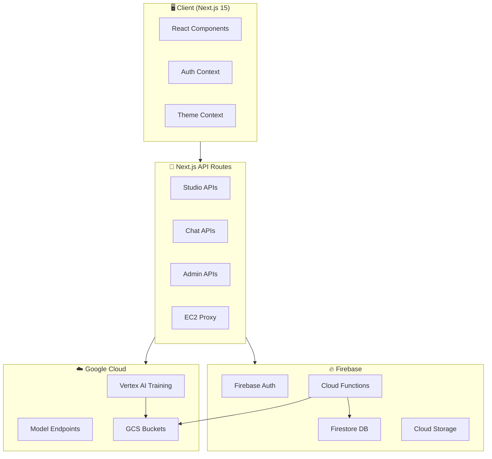
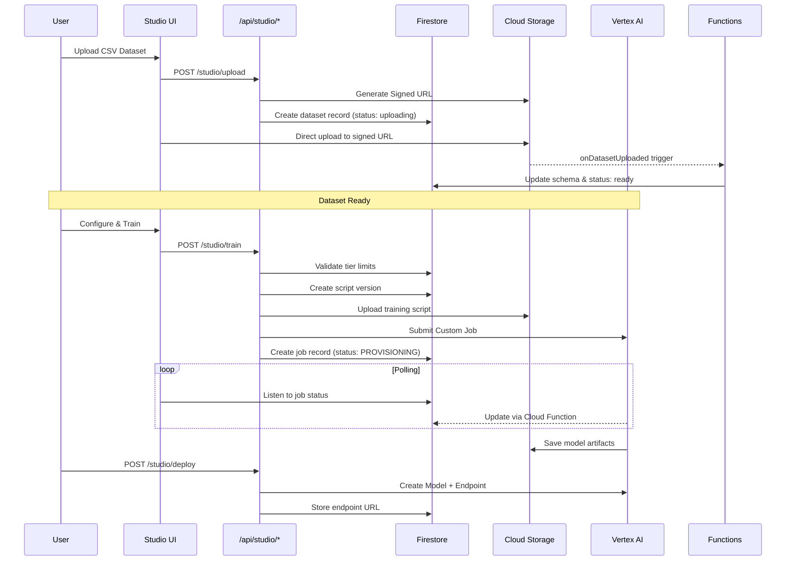
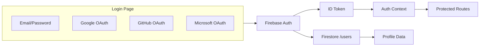
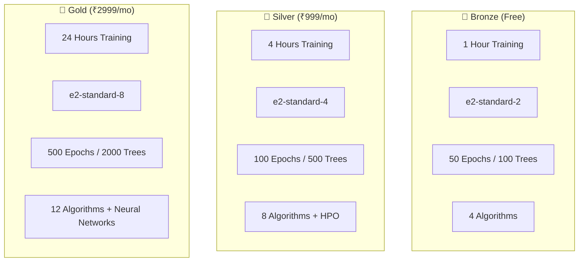

# 🚀 Adhyay ML Studio


**Adhyay ML Studio** is a production-grade, no-code/low-code Machine Learning platform that enables users to upload datasets, train models on Google Cloud Vertex AI, and deploy them with one click. Built with Next.js 15, Firebase, and a glassmorphic UI.

---

## 📋 Table of Contents

- [Features](#-features)
- [Architecture](#-architecture)
- [Tech Stack](#-tech-stack)
- [Project Structure](#-project-structure)
- [API Reference](#-api-reference)
- [Security](#-security)
- [Getting Started](#-getting-started)
- [Environment Variables](#-environment-variables)
- [Deployment](#-deployment)
- [Contributing](#-contributing)

---

## ✨ Features

### 🏠 Landing Page
- Dynamic Silk background animation
- Hero section with call-to-action
- Live terminal demo showcasing ML workflow
- Pricing tiers (Bronze/Silver/Gold)

### 🔐 Authentication
- **Multi-Provider**: Google, GitHub, Microsoft, Apple, Email/Password
- Firebase Auth with Firestore user profiles
- Role-based access (admin claims)
- Password reset via email

### 🧪 ML Studio
- **Upload**: CSV datasets with automatic schema profiling
- **Configure**: Algorithm selection, hyperparameters, cleaning options
- **Train**: Submit jobs to Google Cloud Vertex AI
- **Monitor**: Real-time logs, progress, cost estimation
- **Deploy**: One-click model deployment to endpoints

### 💬 AI Chat
- Multi-model support (GPT-4, Claude 3.5, Gemini 2.0)
- Context-aware responses (dataset/model info)
- Architect agent for code generation guardrails

### 🛍️ Marketplace
- Pre-trained model discovery
- Filter by task type (classification/regression)
- One-click "Try Model" functionality

### 📊 Model Registry
- Version control for models
- Lineage tracking (Dataset → Script → Job → Model → Endpoint)
- Promote versions to production

### 👤 Profile
- Avatar/banner upload to Firebase Storage
- Deployed models and datasets overview
- Security settings (password reset, 2FA status)
- Notification preferences

### 🔧 Admin Dashboard
- Real-time analytics (users, jobs, tier distribution)
- System health monitoring
- Firestore, GCS, Vertex AI status

### 💳 Payments
- Razorpay integration
- Monthly/Annual billing toggle
- Tier-based resource limits

---

## 🏗️ Architecture

### High-Level System Architecture



### Data Flow: Training a Model



### Authentication Flow



### Tier-Based Resource Limits



---

## 🛠️ Tech Stack

| Category | Technology |
|----------|------------|
| **Frontend** | Next.js 15 (App Router), React 19, TypeScript |
| **Styling** | Tailwind CSS, Framer Motion, Glassmorphism |
| **3D/Animation** | React Three Fiber, Three.js, GSAP |
| **Auth** | Firebase Authentication (multi-provider) |
| **Database** | Firebase Firestore (with offline persistence) |
| **Storage** | Firebase Storage, Google Cloud Storage |
| **ML Platform** | Google Cloud Vertex AI |
| **AI Models** | OpenAI GPT-4, Anthropic Claude 3.5, Google Gemini 2.0 |
| **Payments** | Razorpay |
| **CI/CD** | GitHub Actions, Vercel, Firebase Hosting |
| **Backend Functions** | Firebase Cloud Functions (Node.js) |

---

## 📁 Project Structure

```
adhyay/
├── src/
│   ├── app/                    # Next.js App Router
│   │   ├── api/                # API Routes
│   │   │   ├── admin/          # Admin analytics
│   │   │   ├── chat/           # AI chat endpoint
│   │   │   ├── clean-data/     # AI data cleaning
│   │   │   ├── health/         # System health check
│   │   │   ├── payment/        # Razorpay integration
│   │   │   ├── playground/     # Sample datasets
│   │   │   ├── proxy/          # EC2 backend proxy
│   │   │   ├── registry/       # Model registry
│   │   │   ├── share/          # Collaboration
│   │   │   ├── studio/         # Studio APIs (upload, train, deploy, chat)
│   │   │   └── templates/      # Pipeline templates
│   │   ├── admin/              # Admin dashboard
│   │   ├── auth/               # Login/Register pages
│   │   ├── chat/               # AI Chat page
│   │   ├── deploy/             # Deployed models
│   │   ├── marketplace/        # Model marketplace
│   │   ├── pricing/            # Pricing page
│   │   ├── profile/            # User profile
│   │   ├── registry/           # Model registry page
│   │   └── studio/             # ML Studio
│   ├── components/             # React Components
│   │   ├── profile/            # Profile components
│   │   ├── registry/           # LineageGraph
│   │   ├── sections/           # Landing page sections
│   │   ├── sharing/            # ShareModal
│   │   ├── studio/             # ModelConfigPanel, TrainingConsole, DiffViewer
│   │   └── ui/                 # Reusable UI components
│   ├── context/                # React Contexts
│   │   ├── auth-context.tsx    # Firebase Auth
│   │   └── theme-context.tsx   # Theme colors
│   ├── hooks/                  # Custom Hooks
│   │   └── useKeyboardShortcuts.ts
│   └── lib/                    # Utility Libraries
│       ├── firebase.ts         # Firebase client
│       ├── firebase-admin.ts   # Firebase Admin SDK
│       ├── gcp.ts              # Vertex AI + GCS
│       ├── resource-policy.ts  # Tier limits
│       ├── quota.ts            # User quotas
│       ├── alerts.ts           # Alerting system
│       ├── telemetry.ts        # Analytics tracking
│       ├── model-registry.ts   # Model versioning
│       ├── collaboration.ts    # Sharing logic
│       ├── templates.ts        # Pipeline templates
│       ├── data-cleaning.ts    # Data preprocessing
│       ├── chat-commands.ts    # AI chat commands
│       └── sample-datasets.ts  # Playground datasets
├── functions/                  # Firebase Cloud Functions
│   └── src/
│       ├── index.ts            # Dataset upload triggers
│       ├── cleanup.ts          # Scheduled cleanup
│       └── schema-profiler.ts  # CSV schema analysis
├── public/                     # Static assets
│   └── sample_data/            # Sample CSVs
├── firestore.rules             # Security rules
├── firebase.json               # Firebase config
└── .github/workflows/          # CI/CD pipelines
```

---

## 🔌 API Reference

### Studio APIs

| Endpoint | Method | Description |
|----------|--------|-------------|
| `/api/studio/upload` | POST | Generate signed URL for dataset upload |
| `/api/studio/train` | POST | Submit training job to Vertex AI |
| `/api/studio/deploy` | POST | Deploy trained model to endpoint |
| `/api/studio/chat` | POST | AI-powered code generation |

### Registry APIs

| Endpoint | Method | Description |
|----------|--------|-------------|
| `/api/registry/models` | GET | List user's models or public models |
| `/api/registry/models` | POST | Register a new model |
| `/api/registry/models/[id]/versions` | GET | Get model versions |
| `/api/registry/models/[id]/versions/[vid]/promote` | POST | Promote version to production |

### Admin APIs

| Endpoint | Method | Description |
|----------|--------|-------------|
| `/api/admin/analytics` | GET | Usage statistics and metrics |
| `/api/health` | GET | System health (Firestore, GCS, Vertex AI) |

### Other APIs

| Endpoint | Method | Description |
|----------|--------|-------------|
| `/api/chat` | POST | Multi-model AI chat |
| `/api/clean-data` | POST | AI-powered data cleaning |
| `/api/share` | POST/PUT/DELETE | Collaboration management |
| `/api/templates` | GET | Pipeline template suggestions |
| `/api/playground` | GET/POST | Sample datasets & playground |
| `/api/payment/order` | POST | Create Razorpay order |
| `/api/proxy/[...path]` | * | Proxy to EC2 backend |

---

## 🔒 Security

### Firestore Security Rules

```javascript
// Key rules implemented:
- Users can only read/write their own documents
- Projects require ownership or collaborator role
- Collaborator roles: 'viewer', 'editor', 'runner'
- Visibility levels: 'private', 'team', 'public'
- Admin-only access for telemetry and system collections
- Health check endpoint allows writes (for ping tests)
```

### Authentication
- Firebase Auth with multi-provider OAuth
- Server-side validation via `firebase-admin`
- `server-only` import guard for admin SDK

### Resource Limits
- Tier-based limits enforced in API routes
- `validateTrainingConfig()` checks epochs, trees, algorithms
- Dev mode relaxes limits for testing

---

## 🏁 Getting Started

### Prerequisites

- Node.js 18+ 
- Firebase CLI (`npm i -g firebase-tools`)
- Google Cloud SDK (for Vertex AI)
- GCP Project with Vertex AI API enabled

### Installation

```bash
# Clone the repository
git clone https://github.com/Sayandip-Jana/Adhyay.git
cd Adhyay

# Install dependencies
npm install

# Install Firebase Functions dependencies
cd functions && npm install && cd ..

# Login to Firebase
firebase login

# Run development server
npm run dev
```

### Deploy Firebase Functions

```bash
cd functions
npm run build
firebase deploy --only functions
```

### Deploy Firestore Rules

```bash
firebase deploy --only firestore:rules
```

---

## 🔐 Environment Variables

Create a `.env.local` file with:

```env
# Firebase (Client)
NEXT_PUBLIC_FIREBASE_API_KEY=your-api-key
NEXT_PUBLIC_FIREBASE_AUTH_DOMAIN=your-project.firebaseapp.com
NEXT_PUBLIC_FIREBASE_PROJECT_ID=your-project-id
NEXT_PUBLIC_FIREBASE_STORAGE_BUCKET=your-project.appspot.com
NEXT_PUBLIC_FIREBASE_MESSAGING_SENDER_ID=123456789
NEXT_PUBLIC_FIREBASE_APP_ID=1:123456789:web:abc123

# Google Cloud (Server)
GOOGLE_APPLICATION_CREDENTIALS=/path/to/service-account.json
GCP_PROJECT_ID=your-project-id
GCP_REGION=us-central1

# AI Providers
OPENAI_API_KEY=sk-...
ANTHROPIC_API_KEY=sk-ant-...
GOOGLE_GENERATIVE_AI_API_KEY=...

# Razorpay
NEXT_PUBLIC_RAZORPAY_KEY_ID=rzp_test_...
RAZORPAY_KEY_ID=rzp_test_...
RAZOR_SECRET_KEY=...
```

---

## 🚀 Deployment

### Vercel (Frontend)

```bash
# Install Vercel CLI
npm i -g vercel

# Deploy
vercel --prod
```

### Firebase (Functions + Rules)

```bash
firebase deploy
```

### GitHub Actions

The project includes a CI/CD workflow (`.github/workflows/deploy.yml`) that:
1. Runs lint and type checks
2. Builds the Next.js application
3. Deploys to Firebase Functions
4. Deploys to Vercel (production/staging)

---

## 🤝 Contributing

Built with ❤️ by **Sayandip Jana**

### Development Workflow

1. Create feature branch from `main`
2. Make changes with proper TypeScript types
3. Test locally with `npm run dev`
4. Run `npm run lint` before committing
5. Create pull request

### Code Style

- TypeScript strict mode
- ESLint + Prettier
- Glassmorphic UI with Framer Motion
- Use existing patterns in `/lib` for new services

---

## 📄 License

MIT License - See [LICENSE](LICENSE) for details.

---

<div align="center">
  <h3>🚀 Adhyay ML Studio</h3>
  <p>Train. Deploy. Scale.</p>
  <br/>
  <a href="https://adhyay.vercel.app">Live Demo</a> •
  <a href="https://github.com/Sayandip-Jana/Adhyay/issues">Report Bug</a> •
  <a href="https://github.com/Sayandip-Jana/Adhyay/discussions">Discussions</a>
</div>
