# 🚀 AutoForge ML Studio


**AutoForge ML Studio** is a production-grade, no-code/low-code Machine Learning platform that enables users to upload datasets, train models on Google Cloud Vertex AI, and deploy them with one click. Built with Next.js 15, Firebase, and a glassmorphic UI.

---

## 📋 Table of Contents

- [Features](#-features)
- [Architecture](#-architecture)
- [Tech Stack](#-tech-stack)
- [Project Structure](#-project-structure)
- [API Reference](#-api-reference)
- [Security](#-security)
- [Getting Started](#-getting-started)
- [Environment Variables](#-environment-variables)
- [Deployment](#-deployment)
- [Contributing](#-contributing)

---

## ✨ Features

### 🏠 Landing Page
- Dynamic Silk background animation
- Hero section with call-to-action
- Live terminal demo showcasing ML workflow
- Pricing tiers (Bronze/Silver/Gold)

### 🔐 Authentication
- **Multi-Provider**: Google, GitHub, Microsoft, Apple, Email/Password
- Firebase Auth with Firestore user profiles
- Role-based access (admin claims)
- Password reset via email

### 🧪 ML Studio
- **Upload**: CSV datasets with automatic schema profiling
- **Configure**: Algorithm selection, hyperparameters, cleaning options
- **Train**: Submit jobs to Google Cloud Vertex AI
- **Monitor**: Real-time logs, progress, cost estimation
- **Deploy**: One-click model deployment to endpoints

### 💬 AI Chat
- Multi-model support (GPT-4, Claude 3.5, Gemini 2.0)
- Context-aware responses (dataset/model info)
- Architect agent for code generation guardrails

### 🛍️ Marketplace
- Pre-trained model discovery
- Filter by task type (classification/regression)
- One-click "Try Model" functionality

### 📊 Model Registry
- Version control for models
- Lineage tracking (Dataset → Script → Job → Model → Endpoint)
- Promote versions to production

### 👤 Profile
- Avatar/banner upload to Firebase Storage
- Deployed models and datasets overview
- Security settings (password reset, 2FA status)
- Notification preferences

### 🔧 Admin Dashboard
- Real-time analytics (users, jobs, tier distribution)
- System health monitoring
- Firestore, GCS, Vertex AI status

### 💳 Payments
- Razorpay integration
- Monthly/Annual billing toggle
- Tier-based resource limits

### 🤝 Collaboration
- **Share Projects/Datasets/Models** with team members via email
- **Visibility Levels**:
  - `Private` - Only owner can see
  - `Team` - Owner + invited collaborators
  - `Public` - Everyone (appears in Marketplace)
- **Permission Roles**:
  - `View` - Can see data and scripts
  - `Edit` - Can modify code
  - `Run` - Can train models and deploy
- Share via URL - same link works, access controlled by visibility

### 💬 Two Chat Systems

| Feature | **Studio Chat** (in `/studio`) | **Main Chat** (`/chat`) |
|---------|--------------------------------|-------------------------|
| Purpose | Modify training code | General AI conversation |
| Commands | "set epochs to 100", "use XGBoost" | Open-ended questions |
| Context | Your current training script | Your deployed models |
| AI Model | GPT-4 / Claude / Gemini | Same options |

**Studio Chat Commands:**
```
"set test size to 30%"          → Changes train/test split
"use Random Forest"             → Changes algorithm
"set epochs to 200"             → Updates max_iter/epochs
"set learning rate to 0.01"     → Updates lr parameter
"enable hyperparameter tuning"  → Adds GridSearch/HPO
"add f1 metric"                 → Adds evaluation metric
```

### 📥 Code Export
- **Copy to Clipboard**: Click the copy icon in DiffViewer/CodeEditor
- **View Full Script**: Code is always visible in the Studio editor
- **Download**: Right-click code area → "Save As" (browser feature)
- **Script Versions**: All versions saved in Firestore under `projects/{id}/scripts`

---

## 🎨 Latest UI Innovations (v2.0)

### 🌀 Training Progress Overlay
A world-class, immersive full-screen experience during model training:
- **Morphing 3D Sphere** with orbiting particles and physics-based animations
- **Neural Network Visualization** with pulsing nodes and animated connections
- **Hexagon Grid** subtly animated in the background
- **Pulsing Concentric Rings** with depth effects
- **Floating Orbs** with 3D radial gradients and glow effects
- **Typewriter Text Effects** for step transitions
- **Liquid Progress Bar** with shimmer animations
- **Spring-based Staggered Animations** using Framer Motion

### ⚙️ Training Configuration Overlay
A glassmorphic floating panel for fine-tuning training parameters:
- **Tier-based Machine Selection** (E2 series for Vertex AI)
- **Epochs Slider** with tier-aware maximum limits
- **Batch Size Selection** (16, 32, 64, 128)
- **Learning Rate Options** with smart defaults
- **Max Trees Slider** for tree-based algorithms
- **Real-time Config Preview** before training

### 📊 Unified Tab Experience
All Studio outputs consolidated into a single, accessible row:
- **Terminal** - Real-time training logs
- **Versions** - Script version history
- **Journey** - Model lineage visualization
- **Metrics** - Live accuracy and loss metrics

### 🎯 Design Philosophy
- **Glassmorphism** with backdrop blur and transparency
- **Theme-aware** colors that adapt to user preferences
- **Micro-animations** for enhanced engagement
- **Spring physics** for natural, fluid motion
- **Accessibility-first** with proper focus states

---

## 🆕 V5.0 Features (December 2024)

### 🔗 Real-Time Collaboration System

#### MCP Server (`/mcp-server`)
A WebSocket server for real-time code synchronization between MLForge Studio and VS Code.

**Setup:**
```bash
cd mcp-server
npm install
npm run build    # Compile TypeScript
npm start        # Start server on port 4000
```

**Endpoints:**
| Endpoint | Purpose |
|----------|---------|
| `http://localhost:4000` | Health check |
| `ws://localhost:4000/ws` | WebSocket for Yjs sync |

**Features:**
- Yjs CRDT for conflict-free editing
- Firebase Auth integration
- Room-based project isolation

---

#### VS Code Extension (`/vscode-extension`)
Connect VS Code to MLForge for seamless code synchronization.

**Setup:**
```bash
cd vscode-extension
npm install
npm run compile    # Compile TypeScript
npx vsce package --allow-missing-repository  # Build VSIX
code --install-extension mlforge-studio-0.1.0.vsix  # Install
```

**One-Click Connection:**
1. Open your project in MLForge Studio
2. Click the **VS Code icon** in the header
3. VS Code opens and connects automatically
4. Edit in either place - changes sync via Firestore

**Commands (Ctrl+Shift+P):**
| Command | Action |
|---------|--------|
| `MLForge: Connect to Project` | Manual connection to a project |
| `MLForge: Disconnect` | End sync session |
| `MLForge: Push to Cloud` | Manually sync current code |
| `MLForge: Show Connection Status` | View connection state |

**Auto-Sync Features:**
- ✅ **Auto-sync on save** - Press Ctrl+S and code syncs automatically
- ✅ **Jupyter Notebook support** - Syncs all code cells
- ✅ **Persistent connection** - Survives VS Code reloads
- ✅ **Version history** - Each sync creates a new version

**Sync Flow:**


**API Endpoint:**
| Endpoint | Method | Purpose |
|----------|--------|---------|
| `/api/mcp/sync-script` | POST | Sync code from VS Code to Firestore |

---


### 💬 Chat History Persistence

All chat conversations are now saved to Firestore and can be accessed later.

**Sidebar Tabs:**
| Tab | Content |
|-----|---------|
| **Models** | Your trained ML models |
| **History** | Past chat sessions |

**Features:**
- Auto-save messages as you chat
- Session titles from first message
- Click any session to restore
- "New Chat" button for fresh start

**Firestore Structure:**
```
chat_sessions/{sessionId}
  ├── userEmail: "user@email.com"
  ├── title: "How to improve accuracy..."
  ├── lastMessage: "..."
  └── messages/{messageId}
        ├── role: "user" | "assistant"
        ├── content: "..."
        └── createdAt: timestamp
```

---

### ⚡ Apply & Retrain Feature

When AI suggests improvements in Chat, two action buttons appear:

| Button | Action |
|--------|--------|
| **View in Studio** | Opens suggestion as-is in Studio |
| **Apply & Retrain** ⚡ | GenAI generates Python code, then opens Studio |

**Detection Keywords:**
- `feature engineering`, `hyperparameter`, `cross-validation`
- `normalize`, `scale`, `random forest`, `xgboost`
- `epochs`, `learning rate`, `batch size`

---

### 📊 Feature Importance Chart

New component in Studio Metrics tab showing feature importance visualization.

**File:** `src/components/studio/FeatureImportance.tsx`

**Usage:**
```tsx
<FeatureImportance features={[
  { name: 'age', importance: 0.35 },
  { name: 'income', importance: 0.25 }
]} />
```

---

### 🎯 Dataset Quality Score

AI-powered dataset grading system with actionable insights.

**File:** `src/components/studio/DatasetQualityScore.tsx`

**Metrics Analyzed:**
- Missing values percentage
- Duplicate rows
- High cardinality columns
- Feature correlations

**Grades:** A (90-100) → F (0-59)

---

### 📓 Export to Jupyter Notebook

Export training configuration as a ready-to-run `.ipynb` file.

**API:** `POST /api/export/notebook`

**Request:**
```json
{
  "projectName": "Titanic Survival",
  "algorithm": "random_forest",
  "targetColumn": "Survived",
  "featureColumns": ["Age", "Fare", "Pclass"],
  "testSize": 0.2
}
```

**Response:** Downloads `Titanic_Survival_training.ipynb`

---

### 🐛 Bug Fixes (V5.0)
- Fixed `auth` import error in notebook export route
- Improved model name/algorithm fallback logic in Chat
- Deleted duplicate `.agent/` folder (use root `/mcp-server` and `/vscode-extension`)
- Added proper closing tags in Chat history UI

---

## 🆕 V4.0 Features (Latest Session)

### Profile Page Redesign
- **Horizontal Header Layout** - Avatar + Info + Stats + Actions in single row
- **224px Breakout Avatar** - Profile photo breaks out of header card
- **Theme-Matched Colors** - All text, icons, and badges use theme color
- **Centered Tabs** - Overview | Security | Notifications centered

### Collaborative Editing (MCP)
| File | Purpose |
|------|---------|
| `src/hooks/useCollaboration.ts` | Yjs integration for real-time sync |
| `src/components/studio/CollaboratorCursors.tsx` | Shows remote user cursors |
| `src/components/studio/ConnectionStatus.tsx` | Sync indicator |

### Marketplace Fork Button
- Fork any public model into your account
- API: `POST /api/marketplace/{modelId}/fork`
- Creates copy of model metadata + redirects to new project

### API Key System
| Endpoint | Function |
|----------|----------|
| `POST /api/keys` | Create HMAC-hashed API key |
| `GET /api/keys` | List user's keys |
| `DELETE /api/keys` | Revoke key |

### Bug Fixes
- **NaN JSON Parsing** - Metrics with NaN/Infinity now parse correctly
- **BadgeCheck Error** - Fixed TypeScript prop error in Marketplace
- **Models Not Showing** - Fixed field name `ownerEmail` mismatch
- **Stats 0/0** - Now shows real `userModels.length`/`userDatasets.length`
- **Training Overlay** - Added backdrop blur + darken effect

---

## 🚀 V3.0 Features (Latest)

### Sprint 1: Core Automation

#### 📡 Scheduled Metrics Sync
- Cloud Function runs every 5 minutes (`scheduledMetricsSync`)
- Queries global `/jobs` collection for running/pending jobs
- Fetches `metrics.json` from GCS training bucket
- Updates Firestore job documents with latest metrics

#### 📜 Real-Time Training Logs
- **TerminalView** polls `/api/studio/jobs/[id]/logs` every 5 seconds
- 64KB chunked responses with offset-based pagination
- Color-coded output (red=errors, yellow=warnings, green=success)
- Auto-scroll with manual refresh button

#### 🔄 Retry Training Button
- Separate "Retry Training" and "Close" buttons on failure
- Quota-specific messaging with orange styling
- Tracks `retryOf`, `retryReason`, `retryCount` in job document
- Writes to global `/jobs` index for cross-project queries

### Sprint 2: Suggestion System

#### 🎯 Version-Aware Suggestions
- Suggestions store `targetScriptVersion` and `targetVersionId`
- **SuggestionPanel** shows orange "Version Mismatch" warning
- ChatInterface passes current version when creating suggestions

#### 📦 Diff-Based Code Storage
- `src/lib/diff-utils.ts`: `generateDiff()`, `applyDiffPatch()`, `hashText()`
- PATCH API stores `appliedPatch: { diff }` for rollback
- Keeps `currentScriptBeforeApply` for undo functionality

#### 🔍 Duplicate Prevention
- DJB2 hash (`textHash`) generated for each suggestion
- Checks for existing unapplied suggestions before creating
- Returns `{ isDuplicate: true, suggestionId }` if duplicate found

### Sprint 3: Analytics & Visualization

#### 📊 Model Comparison Tab
- ComparisonTab component with version selector (max 5)
- Animated bar charts for Accuracy, Loss, RMSE, Duration
- Handles null metrics with "No metrics available" alert
- Shows 🤖 badge for AI-generated versions

#### 📄 Model Card Generator
- Route: `/studio/[projectId]/model-card`
- Sections: Overview, Metrics, Config, Version History, Limitations
- Export (print) and Share (copy URL) buttons
- Glassmorphic cards matching studio theme

### Sprint 4: Platform Features

#### ⌨️ Keyboard Shortcuts
```tsx
import { useKeyboardShortcuts, COMMON_SHORTCUTS } from '@/hooks/useKeyboardShortcuts';

useKeyboardShortcuts({
  shortcuts: [
    { ...COMMON_SHORTCUTS.save, handler: handleSave },      // ⌘S / Ctrl+S
    { ...COMMON_SHORTCUTS.train, handler: handleTrain },    // ⌘Enter / Ctrl+Enter
    { ...COMMON_SHORTCUTS.closePanel, handler: closePanel } // Escape
  ]
});
```
- `getShortcutDisplay()` shows "⌘S" on Mac, "Ctrl+S" on Windows
- Skips input fields automatically (except Escape)

#### 🔒 API Standardization (RFC 7807)
```tsx
import { validateRequestBody, CommonSchemas } from '@/lib/api-validation';

const result = await validateRequestBody(req, schema);
if ('error' in result) return result.error; // RFC 7807 response
```
- Zod validation with typed responses
- Problem Details helpers: `validationErrorResponse()`, `forbiddenResponse()`, etc.

#### 🔗 Shareable Links
- Route: `/share/[shareId]` - public model card view
- No authentication required
- Copy link button with success feedback
- Fetches from `shared_models` collection

---

## 🏗️ Architecture

### High-Level System Architecture

```mermaid
flowchart TB
    subgraph Client["🖥️ Client (Next.js 15)"]
        UI["React Components"]
        Auth["Auth Context"]
        Theme["Theme Context"]
    end
    
    subgraph Firebase["🔥 Firebase"]
        FAuth["Firebase Auth"]
        Firestore["Firestore DB"]
        Storage["Cloud Storage"]
        Functions["Cloud Functions"]
    end
    
    subgraph GCP["☁️ Google Cloud"]
        VertexAI["Vertex AI Training"]
        Endpoints["Model Endpoints"]
        GCS["GCS Buckets"]
    end
    
    subgraph APIs["🔌 Next.js API Routes"]
        StudioAPI["Studio APIs"]
        ChatAPI["Chat APIs"]
        AdminAPI["Admin APIs"]
        ProxyAPI["EC2 Proxy"]
    end
    
    Client --> APIs
    APIs --> Firebase
    APIs --> GCP
    Functions --> Firestore
    Functions --> GCS
    VertexAI --> GCS
```



### Data Flow: Training a Model


### Authentication Flow


### Tier-Based Resource Limits

```mermaid
flowchart TB
    subgraph Free["🥉 Bronze (Free)"]
        F1["1 Hour Training"]
        F2["e2-standard-2"]
        F3["50 Epochs / 100 Trees"]
        F4["4 Algorithms"]
    end
    
    subgraph Silver["🥈 Silver (₹999/mo)"]
        S1["4 Hours Training"]
        S2["e2-standard-4"]
        S3["100 Epochs / 500 Trees"]
        S4["8 Algorithms + HPO"]
    end
    
    subgraph Gold["🥇 Gold (₹2999/mo)"]
        G1["24 Hours Training"]
        G2["e2-standard-8"]
        G3["500 Epochs / 2000 Trees"]
        G4["12 Algorithms + Neural Networks"]
    end
```



---

## 🛠️ Tech Stack

| Category | Technology |
|----------|------------|
| **Frontend** | Next.js 15 (App Router), React 19, TypeScript |
| **Styling** | Tailwind CSS, Framer Motion, Glassmorphism |
| **3D/Animation** | React Three Fiber, Three.js, GSAP |
| **Auth** | Firebase Authentication (multi-provider) |
| **Database** | Firebase Firestore (with offline persistence) |
| **Storage** | Firebase Storage, Google Cloud Storage |
| **ML Platform** | Google Cloud Vertex AI |
| **AI Models** | OpenAI GPT-4, Anthropic Claude 3.5, Google Gemini 2.0 |
| **Payments** | Razorpay |
| **CI/CD** | GitHub Actions, Vercel, Firebase Hosting |
| **Backend Functions** | Firebase Cloud Functions (Node.js) |

---

## 📁 Project Structure

```
autoforge/
├── src/
│   ├── app/                    # Next.js App Router
│   │   ├── api/                # API Routes
│   │   │   ├── admin/          # Admin analytics
│   │   │   ├── chat/           # AI chat endpoint
│   │   │   ├── clean-data/     # AI data cleaning
│   │   │   ├── health/         # System health check
│   │   │   ├── payment/        # Razorpay integration
│   │   │   ├── playground/     # Sample datasets
│   │   │   ├── proxy/          # EC2 backend proxy
│   │   │   ├── registry/       # Model registry
│   │   │   ├── share/          # Collaboration
│   │   │   ├── studio/         # Studio APIs (upload, train, deploy, chat)
│   │   │   ├── mcp/            # VS Code sync API
│   │   │   │   └── sync-script/route.ts
│   │   │   └── templates/      # Pipeline templates
│   │   ├── admin/              # Admin dashboard
│   │   ├── auth/               # Login/Register pages
│   │   ├── chat/               # AI Chat page
│   │   ├── deploy/             # Deployed models
│   │   ├── marketplace/        # Model marketplace
│   │   ├── pricing/            # Pricing page
│   │   ├── profile/            # User profile
│   │   ├── registry/           # Model registry page
│   │   └── studio/             # ML Studio
│   ├── components/             # React Components
│   │   ├── profile/            # Profile components
│   │   ├── registry/           # LineageGraph
│   │   ├── sections/           # Landing page sections
│   │   ├── sharing/            # ShareModal
│   │   ├── studio/             # ModelConfigPanel, TrainingConsole, DiffViewer
│   │   └── ui/                 # Reusable UI components
│   ├── context/                # React Contexts
│   │   ├── auth-context.tsx    # Firebase Auth
│   │   └── theme-context.tsx   # Theme colors
│   ├── hooks/                  # Custom Hooks
│   │   └── useKeyboardShortcuts.ts
│   └── lib/                    # Utility Libraries
│       ├── firebase.ts         # Firebase client
│       ├── firebase-admin.ts   # Firebase Admin SDK
│       ├── gcp.ts              # Vertex AI + GCS
│       ├── resource-policy.ts  # Tier limits
│       ├── quota.ts            # User quotas
│       ├── alerts.ts           # Alerting system
│       ├── telemetry.ts        # Analytics tracking
│       ├── model-registry.ts   # Model versioning
│       ├── collaboration.ts    # Sharing logic
│       ├── templates.ts        # Pipeline templates
│       ├── data-cleaning.ts    # Data preprocessing
│       ├── chat-commands.ts    # AI chat commands
│       └── sample-datasets.ts  # Playground datasets
├── vscode-extension/           # VS Code Extension
│   ├── src/
│   │   ├── extension.ts        # Main extension entry
│   │   ├── mcp-client.ts       # Yjs WebSocket client
│   │   ├── status-bar.ts       # Status bar manager
│   │   └── collaborators-view.ts
│   └── package.json
├── mcp-server/                 # WebSocket sync server
│   └── src/
│       └── index.ts            # Yjs server
├── functions/                  # Firebase Cloud Functions
│   └── src/
│       ├── index.ts            # Dataset upload triggers
│       ├── cleanup.ts          # Scheduled cleanup
│       └── schema-profiler.ts  # CSV schema analysis
├── public/                     # Static assets
│   └── sample_data/            # Sample CSVs
├── firestore.rules             # Security rules
├── firebase.json               # Firebase config
└── .github/workflows/          # CI/CD pipelines
```

---

## 🔌 API Reference

### Studio APIs

| Endpoint | Method | Description |
|----------|--------|-------------|
| `/api/studio/upload` | POST | Generate signed URL for dataset upload |
| `/api/studio/train` | POST | Submit training job to Vertex AI |
| `/api/studio/deploy` | POST | Deploy trained model to endpoint |
| `/api/studio/chat` | POST | AI-powered code generation |

### Registry APIs

| Endpoint | Method | Description |
|----------|--------|-------------|
| `/api/registry/models` | GET | List user's models or public models |
| `/api/registry/models` | POST | Register a new model |
| `/api/registry/models/[id]/versions` | GET | Get model versions |
| `/api/registry/models/[id]/versions/[vid]/promote` | POST | Promote version to production |

### Admin APIs

| Endpoint | Method | Description |
|----------|--------|-------------|
| `/api/admin/analytics` | GET | Usage statistics and metrics |
| `/api/health` | GET | System health (Firestore, GCS, Vertex AI) |

### Other APIs

| Endpoint | Method | Description |
|----------|--------|-------------|
| `/api/chat` | POST | Multi-model AI chat |
| `/api/clean-data` | POST | AI-powered data cleaning |
| `/api/share` | POST/PUT/DELETE | Collaboration management |
| `/api/templates` | GET | Pipeline template suggestions |
| `/api/playground` | GET/POST | Sample datasets & playground |
| `/api/payment/order` | POST | Create Razorpay order |
| `/api/proxy/[...path]` | * | Proxy to EC2 backend |
| `/api/mcp/sync-script` | POST | VS Code → Firestore code sync |

---

## 🔒 Security

### Firestore Security Rules

```javascript
// Key rules implemented:
- Users can only read/write their own documents
- Projects require ownership or collaborator role
- Collaborator roles: 'viewer', 'editor', 'runner'
- Visibility levels: 'private', 'team', 'public'
- Admin-only access for telemetry and system collections
- Health check endpoint allows writes (for ping tests)
```

### Authentication
- Firebase Auth with multi-provider OAuth
- Server-side validation via `firebase-admin`
- `server-only` import guard for admin SDK

### Resource Limits
- Tier-based limits enforced in API routes
- `validateTrainingConfig()` checks epochs, trees, algorithms
- Dev mode relaxes limits for testing

---

## 🏁 Getting Started

### Prerequisites

- Node.js 18+ 
- Firebase CLI (`npm i -g firebase-tools`)
- Google Cloud SDK (for Vertex AI)
- GCP Project with Vertex AI API enabled

### Installation

```bash
# Clone the repository
git clone https://github.com/Sayandip-Jana/MLForge.git
cd MLForge

# Install dependencies
npm install

# Install Firebase Functions dependencies
cd functions && npm install && cd ..

# Login to Firebase
firebase login

# Run development server
npm run dev
```

### Deploy Firebase Functions

```bash
cd functions
npm run build
firebase deploy --only functions
```

### Deploy Firestore Rules

```bash
firebase deploy --only firestore:rules
```

---

## 🔐 Environment Variables

Create a `.env.local` file with:

```env
# Firebase (Client)
NEXT_PUBLIC_FIREBASE_API_KEY=your-api-key
NEXT_PUBLIC_FIREBASE_AUTH_DOMAIN=your-project.firebaseapp.com
NEXT_PUBLIC_FIREBASE_PROJECT_ID=your-project-id
NEXT_PUBLIC_FIREBASE_STORAGE_BUCKET=your-project.appspot.com
NEXT_PUBLIC_FIREBASE_MESSAGING_SENDER_ID=123456789
NEXT_PUBLIC_FIREBASE_APP_ID=1:123456789:web:abc123

# Google Cloud (Server)
GOOGLE_APPLICATION_CREDENTIALS=/path/to/service-account.json
GCP_PROJECT_ID=your-project-id
GCP_REGION=us-central1

# AI Providers
OPENAI_API_KEY=sk-...
ANTHROPIC_API_KEY=sk-ant-...
GOOGLE_GENERATIVE_AI_API_KEY=...

# Razorpay
NEXT_PUBLIC_RAZORPAY_KEY_ID=rzp_test_...
RAZORPAY_KEY_ID=rzp_test_...
RAZOR_SECRET_KEY=...
```

---

## 🚀 Deployment

### Vercel (Frontend)

```bash
# Install Vercel CLI
npm i -g vercel

# Deploy
vercel --prod
```

### Firebase (Functions + Rules)

```bash
firebase deploy
```

### GitHub Actions

The project includes a CI/CD workflow (`.github/workflows/deploy.yml`) that:
1. Runs lint and type checks
2. Builds the Next.js application
3. Deploys to Firebase Functions
4. Deploys to Vercel (production/staging)

---

## 🤝 Contributing

Built with ❤️ by **Sayandip Jana**

### Development Workflow

1. Create feature branch from `main`
2. Make changes with proper TypeScript types
3. Test locally with `npm run dev`
4. Run `npm run lint` before committing
5. Create pull request

### Code Style

- TypeScript strict mode
- ESLint + Prettier
- Glassmorphic UI with Framer Motion
- Use existing patterns in `/lib` for new services

---

## 📄 License

MIT License - See [LICENSE](LICENSE) for details.

---

<div align="center">
  <h3>🚀 AutoForge ML Studio</h3>
  <p>Train. Deploy. Scale.</p>
  <br/>
</div>
